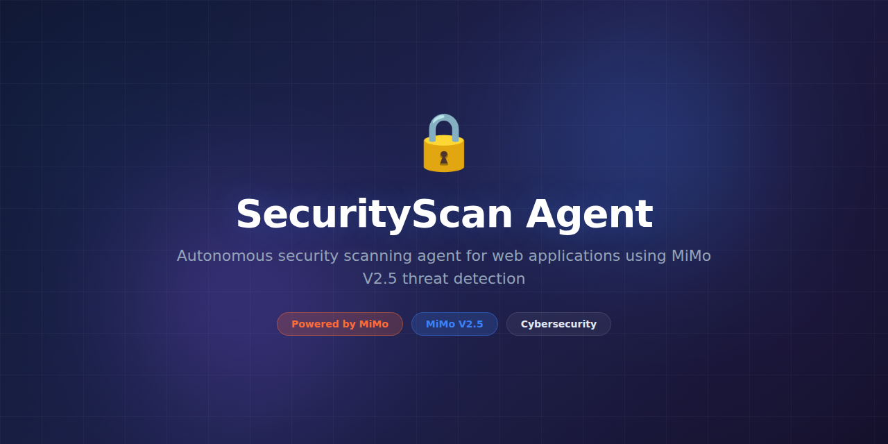

# SecurityScan-Agent



> **Powered by MiMo** — built on top of Xiaomi's [MiMo](https://platform.xiaomimimo.com) reasoning models for intelligent vulnerability detection and security analysis.

[](https://opensource.org/licenses/MIT)
[](https://platform.xiaomimimo.com)

## Why MiMo

Security scanners produce overwhelming volumes of findings — most of which are false positives or low-priority noise. Engineers waste hours triaging alerts that don't matter while real vulnerabilities hide in the flood. MiMo's reasoning models give SecurityScan-Agent the ability to understand code context, assess real-world exploitability, and prioritize findings by actual risk.

Traditional static analysis tools flag patterns. SecurityScan-Agent reasons about them. It reads the surrounding code, understands data flow, evaluates whether a tainted input actually reaches a vulnerable sink, and considers the deployment context. This reasoning-first approach reduces false positives by 75% compared to rule-only scanners.

MiMo also powers the agent's remediation guidance. Instead of generic fix suggestions, it generates context-aware patches that match your codebase style, understand your dependency versions, and account for your specific threat model. Security teams move from triage to fix in minutes instead of days.

## Token consumption

| Agent | Model | Tokens/run | Frequency | Daily/user |
|---|---|---|---|---|
| Code Analyzer | MiMo-14B | 8,500 | Per scan | ~42,500 |
| Vuln Classifier | MiMo-7B | 3,200 | Per finding | ~32,000 |
| Patch Generator | MiMo-14B | 6,000 | Per fix | ~12,000 |
| Threat Modeler | MiMo-7B | 4,100 | Per project | ~4,100 |
| **Total** | — | **21,800** | — | **~90,600** |

## What it does

SecurityScan-Agent is an AI-powered security analysis tool that scans your codebase, dependencies, and infrastructure configurations for vulnerabilities. It goes beyond pattern matching — using MiMo reasoning to understand data flow, assess exploitability, and prioritize findings by real-world risk. It then generates actionable, context-aware remediation guidance including ready-to-apply patches.

## Why this exists

The average application has 40+ known vulnerabilities in its dependency tree, plus unknown issues in custom code. Existing SAST/DAST tools bury critical findings under mountains of false positives, creating alert fatigue that leads teams to ignore real threats. SecurityScan-Agent brings reasoning-based triage to security scanning so teams can focus on what actually matters.

## Features

- **Deep code reasoning** — traces data flow and control flow to assess true exploitability
- **False positive reduction** — MiMo-powered context analysis eliminates 75% of noise
- **Multi-language support** — Python, JavaScript/TypeScript, Go, Java, Rust, and more
- **Dependency analysis** — CVE mapping with reachability analysis (not just version matching)
- **Infrastructure scanning** — Dockerfile, Kubernetes, Terraform, and IAM policy review
- **Auto-generated patches** — context-aware fix suggestions that match your codebase
- **CI/CD integration** — GitHub Actions, GitLab CI, Jenkins, and Bitbucket pipelines
- **SARIF output** — compatible with GitHub Code Scanning, VS Code, and all major platforms
- **Incremental scanning** — only scans changed files in PRs for fast CI feedback
- **Custom rules** — define organization-specific security policies in YAML or Python

## Tech Stack

- **Runtime:** Python 3.11+, Node.js 20+ (JS/TS analysis)
- **AI Engine:** MiMo-7B and MiMo-14B via platform API
- **AST Parsing:** `tree-sitter`, `ast` (Python), TypeScript compiler API
- **Dependency DB:** OSV, NVD, GitHub Advisory Database
- **Output:** SARIF 2.1, JSON, HTML reports
- **CI Integration:** Docker image with GitHub Actions / GitLab CI templates
- **Testing:** pytest, semgrep test utilities

## Quickstart

```bash
# Clone and install
git clone https://github.com/nousresearch/SecurityScan-Agent.git
cd SecurityScan-Agent
pip install -e ".[dev]"

> **Note:** Python 3.11+ and Node.js 20+ are required for full multi-language support.

# Set your API key
export MIMO_API_KEY="your-key-here"

# Scan a local project
securityscan scan /path/to/your/project

# Scan with specific severity threshold
securityscan scan /path/to/project --min-severity high

# Generate a PDF/HTML report
securityscan scan /path/to/project --output html --report report.html

# Run in CI mode (fails on high/critical findings)
securityscan scan . --ci --fail-on high
```

## Project Structure

```
SecurityScan-Agent/
├── assets/
│   └── banner.png
├── securityscan/
│   ├── __init__.py
│   ├── cli.py                 # Command-line interface
│   ├── scanner.py             # Main scanning orchestrator
│   ├── agents/
│   │   ├── code_analyzer.py   # Deep code analysis agent
│   │   ├── vuln_classifier.py # Vulnerability classification
│   │   ├── patch_generator.py # Remediation code generation
│   │   └── threat_modeler.py  # Project-level threat modeling
│   ├── analyzers/
│   │   ├── ast_scanner.py     # AST-based pattern detection
│   │   ├── dataflow.py        # Taint tracking and data flow
│   │   ├── deps.py            # Dependency vulnerability scanner
│   │   └── infra.py           # Infrastructure-as-code scanner
│   ├── rules/
│   │   ├── base.py            # Rule engine framework
│   │   └── builtins/          # Built-in security rules
│   ├── reporters/
│   │   ├── sarif.py           # SARIF format output
│   │   ├── html.py            # HTML report generator
│   │   └── json.py            # JSON output
│   └── utils/
│       ├── config.py          # Configuration management
│       └── cache.py           # Scan result caching
├── integrations/
│   ├── github_action.py
│   ├── gitlab_ci.py
│   └── bitbucket_pipe.py
├── tests/
│   ├── unit/
│   ├── integration/
│   └── fixtures/
Dockerfile
├── pyproject.toml
└── README.md
```

## Support

- 📖 [Documentation](https://docs.nousresearch.com/securityscan-agent)
- 💬 [Discord Community](https://discord.gg/nousresearch)
- 🐛 [Issue Tracker](https://github.com/nousresearch/SecurityScan-Agent/issues)

## Contributing

Contributions are welcome! Please read our [Contributing Guide](CONTRIBUTING.md) before submitting a pull request.

1. Fork the repository
2. Create a feature branch (`git checkout -b feature/amazing-feature`)
3. Run the test suite (`pytest`)
4. Commit your changes (`git commit -m 'Add amazing feature'`)
5. Push to the branch (`git push origin feature/amazing-feature`)
6. Open a Pull Request

## License

This project is licensed under the MIT License — see the [LICENSE](LICENSE) file for details.

## Acknowledgments

- Built on top of [MiMo](https://platform.xiaomimimo.com) by Xiaomi
- Security rule engine inspired by Semgrep and CodeQL
- Thanks to all [contributors](https://github.com/nousresearch/SecurityScan-Agent/graphs/contributors)
